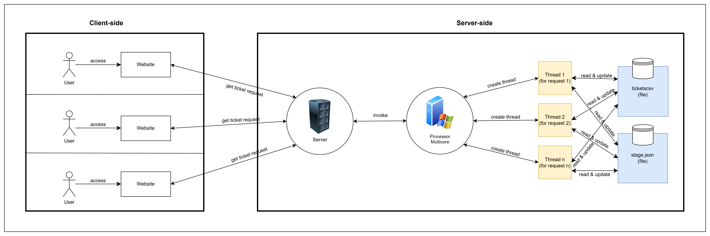

# Tugas Besar Sistem Terdistribusi - Aplikasi Pembelian Tiket Konser VTuber Berbasis Sistem Terdistribusi

## Pendahuluan
Aplikasi ini bertujuan untuk mengatasi tantangan dalam mengelola penjualan tiket konser VTuber dengan jumlah penggemar yang besar dan permintaan yang tinggi.

## Teknologi yang Digunakan

Berikut adalah daftar teknologi yang digunakan dalam pengembangan aplikasi:

| No. | Nama Teknologi   | Deskripsi                                                                                                                                                                                                                                              |
| --- | ---------------- | ------------------------------------------------------------------------------------------------------------------------------------------------------------------------------------------------------------------------------------------------------ |
| 1   | Python           | Python merupakan bahasa pemrograman komputer yang biasa dipakai untuk membangun situs, software/aplikasi, mengotomatiskan tugas, dan melakukan analisis data. Python memiliki fitur threading yang memungkinkan pemrosesan secara paralel untuk menangani banyak tugas secara sekaligus. |
| 2   | Visual Studio Code | Visual Studio Code merupakan aplikasi code editor yang dikembangkan oleh Microsoft. Dalam konteks pengembangan aplikasi pembelian tiket konser VTuber berbasis sistem terdistribusi, Visual Studio Code digunakan untuk menulis, mengedit, dan mengelola kode sumber aplikasi. |
| 3   | Tailwind CSS     | Tailwind CSS merupakan framework CSS yang berbasis utility untuk membuat UI atau tampilan dari aplikasi web. Berbasis utility artinya Tailwind hanya terdiri dari 100% utility class dan tidak ada class komponen seperti Navbar, Button, Card, Modal, dll.   |
| 4   | React            | React adalah library JavaScript populer buatan Facebook yang digunakan dalam pengembangan aplikasi mobile dan web. React berisi kumpulan snippet kode JavaScript (komponen) yang bisa digunakan berulang kali untuk mendesain antarmuka pengguna.               |
| 5   | TypeScript       | TypeScript adalah bahasa pemrograman berbasis JavaScript yang menambahkan fitur strong-typing & konsep pemrograman OOP klasik (class, interface). TypeScript disebut sebagai superset dari JavaScript, menawarkan class, module, dan interface untuk mengembangkan aplikasi kompleks dengan lebih mudah. |
| 6   | Vite             | Vite adalah framework JavaScript open-source yang digunakan untuk membangun aplikasi frontend yang cepat dan efisien. Vite berfokus pada performa yang cepat dan pengembangan yang mudah, serta mendukung hot-reloading untuk melihat perubahan pada kode secara langsung.   |
| 7   | Node.js          | Node.js adalah runtime environment untuk JavaScript yang bersifat open-source dan cross-platform. Node.js menjalankan V8 JavaScript engine di luar browser, memungkinkan penggunaan JavaScript di berbagai lingkungan, termasuk pengembangan aplikasi web.         |

## Pembagian Tugas dan Tanggung Jawab Anggota Kelompok

Berikut adalah pembagian tugas dan tanggung jawab masing-masing anggota tim dalam pengembangan aplikasi:

| No. | Nama Anggota          | Tugas dan Tanggung Jawab                                                                                                                                     |
| --- | --------------------- | ------------------------------------------------------------------------------------------------------------------------------------------------------------- |
| 1   | Jovan Shelomo         | - Pemilik Repository <br> - Dokumentasi Laporan <br> - Programmer                                                                                           |
| 2   | Muhammad Rafi Farhan  | - Dokumentasi Laporan <br> - Programmer                                                                                                                       |
| 3   | Rachmat Purwa Saputra | - Ketua <br> - Dokumentasi Laporan <br> - Programmer                                                                                                          |
| 4   | Reihan Hadi Fauzan    | - Dokumentasi Laporan <br> - Programmer                                                                                                                       |

## Analisis Alasan Pemilihan Tema dan Solusi

Aplikasi ini dipilih sebagai solusi untuk mengatasi tantangan dalam mengelola penjualan tiket konser VTuber karena kebutuhan akan sistem yang dapat mengelola lalu lintas pengguna yang tinggi, ketersediaan tiket secara real-time, dan mencegah kesalahan dalam pembelian tiket. Solusi ini juga memungkinkan penggemar untuk mengakses acara-acara tersebut dengan lebih mudah.

## Arsitektur Sistem dan Jaringan

### 1.Arsitektur Sistem:

Kami merancang aplikasi ini dengan sistem terdistribusi yang mengadopsi arsitektur berbasis client-server.

**Client Side:**
- **Komponen:** Web Browser / HTTP Client.
- **Proses:**
  - **Permintaan HTTP:** Klien mengirimkan permintaan HTTP ke server, bisa berupa GET untuk mendapatkan data (seperti daftar stage atau tiket) atau POST untuk membeli tiket.
  - **Pengolahan Respons:** Klien menerima respons HTTP dari server dalam format JSON untuk diolah atau ditampilkan.

**Server Side:**
- **Komponen:** ThreadingHTTPServer, Handler, Handlers Functions.
- **Proses:**
  - **Penerimaan Permintaan:** Server menerima permintaan dari klien dan menggunakan Handler untuk menentukan tindakan yang tepat.
  - **Pengolahan Data:** Berdasarkan jenis permintaan, server membaca atau menulis ke database menggunakan semaphore untuk menjaga integritas data.
  - **Pengiriman Respons:** Setelah permintaan diproses, server mengirimkan respons dalam format JSON kembali ke klien.

### 2. Arsitektur Jaringan:

**Client Network:**
- **Komponen:** Jaringan yang digunakan oleh klien untuk mengirim permintaan HTTP ke server, bisa LAN atau internet.
- **Komunikasi:** Klien mengirimkan permintaan melalui protokol HTTP ke alamat IP dan port server.

**Server Network:**
- **Komponen:** Jaringan tempat server berada, bisa lokal atau terhubung ke internet.
- **Komunikasi:** Server mendengarkan permintaan pada alamat IP tertentu dan port tertentu.

### 3. Alur Proses Aplikasi

**Permintaan Untuk Mendaftar Stage (GET /stages):**
- Klien mengirimkan permintaan GET untuk mendapatkan daftar stage.
- Server memproses permintaan dan mengirim respons berisi daftar stage kembali ke klien.

**Permintaan Untuk Mendapatkan Tiket (GET /my-tickets):**
- Klien mengirimkan permintaan GET untuk mendapatkan daftar tiket milik pengguna tertentu.
- Server memproses permintaan dan mengirim respons berisi daftar tiket kembali ke klien.

**Klien Mengirim Permintaan Untuk Membeli Tiket (POST /buy-tickets):**
- Klien mengirimkan permintaan POST untuk membeli tiket dengan data JSON.
- Server memproses permintaan dan mengirim respons berisi informasi tiket yang berhasil dibeli kembali ke klien.

### 4. Penanganan Kesalahan

**Permintaan dengan Parameter Tidak Lengkap atau Tidak Valid:**
- Jika permintaan tidak menyertakan parameter yang diperlukan atau parameter tidak valid, server mengirimkan respons kesalahan yang sesuai ke klien.

**Kesalahan Akses Berkas:**
- Jika terjadi kesalahan saat membaca atau menulis berkas, server mengirimkan respons kesalahan internal server ke klien.


## Model Sistem yang Dibangun



<p>Secara garis besar, model sistem yang akan dikembangkan terbagi ke dalam dua ranah: ranah client (client side) serta ranah peladen (server side). Pada client side, satu orang atau lebih user mengakses tampilan antarmuka web aplikasi pemesanan tiket Hololive. Melalui tampilan itulah user dapat melakukan web request untuk melakukan login dengan username, melihat daftar tiket untuk setiap stages, melakukan pemesanan sejumlah tiket, dan melihat riwayat pembelian tiket yang sebelumnya sudah dilakukan.</p>

<p>Pada sisi server, terdapat dua buah file persistence untuk menyimpan data-data yang diperlukan pada keperluan transaksional proses pemesanan tiket Hololive. Sebuah file bernama stages.json berisi daftar master mengenai stok dan harga tiket untuk setiap stage yang disediakan. Satu file lain bernama ticket.csv akan bertindak sebagai file berisi daftar riwayat pembelian tiket yang sudah dilakukan semua user. Nama-nama kolom pada file ticket.csv adalah ticket_id bertipe UUID, stage_id, timestamp waktu pembelian tiket, dan username sesuai yang dientrikan user pada saat login ke dalam aplikasi.</p>

<p>Ketika permintaan request pemesanan tiket diterima server, server akan melakukan invocation untuk membuat thread baru sejumlah banyaknya user yang mengakses aplikasi. Misalkan, terdapat 3 request pemesanan tiket, maka server akan membuat 3 buah thread berbeda untuk melayani pemesanan tiket ketiga user tadi. Proses pada thread memanfaatkan Semaphore untuk locking resources dua buah file persistence pada server, memastikan aspek eventual consistency dari transaksi pembelian tiket Hololive dalam aplikasi. Hasil response dari server yang akan diterima client bisa berupa keberhasilan pemesanan tiket yang mengurangi stok dari file stages.json dan mencatatkan riwayat transaksi pada file tickets.csv, ataupun berupa kegagalan dengan menampilkan error message kepada user.</p>

<p>Fitur login tidak dilengkapi dengan autentikasi dengan suatu data user karena konteks login bukan untuk mengautentikasi siapa user yang mengakses aplikasi. Penyediaan fitur login dengan username hanya ditujukan untuk membedakan user yang membeli setiap tiket sehingga riwayat pembelian yang ditampilkan hanyalah riwayat pembelian tiket yang berasal dari username yang login ke dalam aplikasi saja (tidak menampilkan riwayat pembelian dari semua user). 
</p>


## Prerequisite

- Node.js 20
- Python 3.12

## How to run

1. Clone repository ini ke dalam perangkat lokal Anda dengan menjalankan perintah berikut pada terminal atau command prompt:
    ```bash
    git clone https://github.com/jovanshelomoJTK/hololive-ticketing.git
    ```

2. Setelah proses cloning selesai, buka folder proyek ini pada Visual Studio Code.
   
3. Jalankan perintah berikut pada terminal atau command prompt untuk menginstall dependencies yang diperlukan:
    ```bash
    npm install
    ```
    
4. Tunggu hingga proses instalasi dependencies selesai dan sukses. Setelah itu, proyek siap untuk dijalankan dengan perintah berikut:
    ```bash
    npm run dev
    ```

5. Pada browser, bukalah alamat [http://localhost:5173](http://localhost:5173) untuk mengakses aplikasi.

6. Loginlah dengan menggunakan username apapun yang diinginkan. Username diperlukan untuk membedakan pengguna yang berbeda serta menandai tiket yang dimiliki oleh pengguna tersebut. Ini berguna ketika aplikasi menampilkan riwayat pembelian tiket, sehingga pengguna tidak akan melihat tiket yang dimiliki oleh pengguna lain.


## Skema-skema proses bisnis aplikasi yang patut diperhatikan

1. Saat pengguna memasukkan jumlah tiket kurang dari 1, aplikasi akan memaksa pengguna memesan 1 tiket dan secara otomatis akan terjadi transaksi pembelian tiket sebanyak 1 tiket.
2. Saat pengguna memasukkan jumlah tiket yang lebih besar dari jumlah tiket yang tersedia, aplikasi akan memaksa pengguna memesan tiket sebanyak jumlah tiket yang tersedia dan secara otomatis akan terjadi transaksi pembelian tiket sebanyak jumlah tiket yang tersedia.